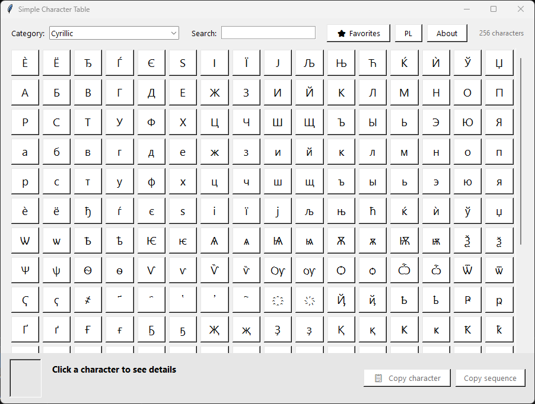

# Simple Character Table



A simple Unicode character browser written in Python using the Tkinter library.

This tool serves as an alternative to the Windows Charmap app and lets you quickly browse Unicode characters, search by name or code, and copy them to the clipboard.

## Features

- browse characters from different Unicode categories
- search characters by:
  - character
  - hexadecimal code
  - Unicode name
- preview the selected character with code details
- copy a character to the clipboard
- copy Python/HTML escape sequences
- support for favorite characters
- interface available in Polish and English

## Requirements

- Python 3
- Tkinter library (usually included with Python)

## Running the app

On Windows, you can launch the program with:

```bash
py "Simple Character Table.py"
```

If Python is installed as `python`, use:

```bash
python "Simple Character Table.py"
```

## Project structure

- `Simple Character Table.py` — main application file
- `ulubione.txt` — file storing favorite characters (created automatically)

## Example usage

1. Launch the application.
2. Choose a character category.
3. Click a character to view its details.
4. Copy the character or sequence to the clipboard.

## Screenshot


## Author

Sebastian Januchowski

## Contact

- E-mail: polsoft.its@mail.com
- GitHub: https://github.com/polsoft-its-uk
